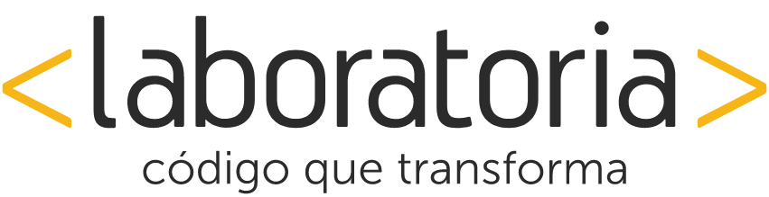
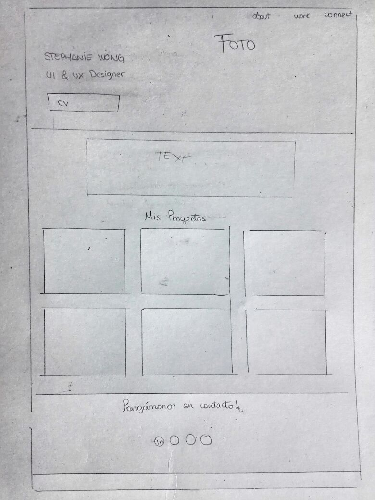
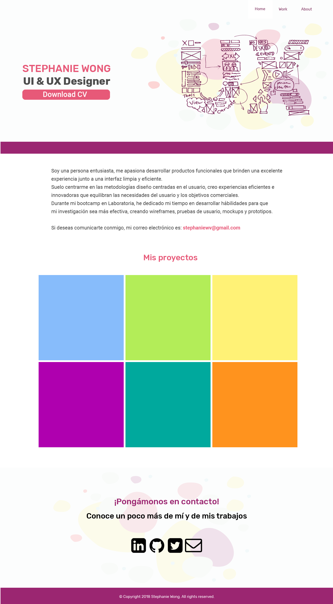

## PORTAFOLIO

### IDEA DE TRABAJO:

Crear un portafolio que contenga los trabajos realizados en el periodo del bootcamp de Laboratoria con la finalidad de demostrar mis conocimientos en UI & UX Design

## RESEARCH : Entendiendo las necesidades del usuario

Para crear el portafolio, se ha tomado en cuenta lo que la usuaria desea vender como imagen personal y profesional.

#### SKETCH

Se ha realizado el siguiente skecth con la finalidad de poder plasmar la idea. 

#### MOCKUPS

1. Vista Principal

### **Integrante**

>##### Stephanie Carolina Wong Vega

"La última y mejor experiencia que alguien tiene en cualquier lugar se convierte en la expectativa mínima de las experiencias que desean en todas partes."